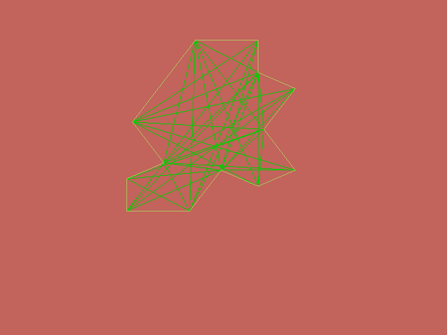

# Monotile Visualizer

This project is based on the paper [An aperiodic monotile](https://cs.uwaterloo.ca/~csk/hat/). As shown in the paper, the monotile is in fact a continuous spectrum of shapes capable of tiling an infinite plane without ever becoming periodic. In this spectrum, edge proportions and angles between them are constant, so it's possible to generate these tiles proceduraly.

## Rendering with OpenGL

Although edges and vertices are easy to calculate, there is still a need to fill the shape using triangles. By morphing through the entire spectrum it is possible to determine what vertices can always be connected, this way we can determine the vertices that make up the triangles inside the shape.

